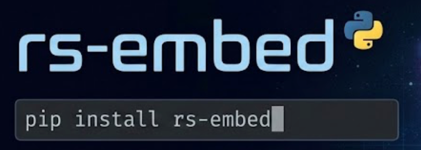

# **rs-embed**




**A unified Python toolkit for Remote Sensing Foundation Model embeddings**


> One line of code to get embeddings from **any Remote Sensing (RS) foundation model** for a given ROI.
> Supports both **precomputed embeddings** (Tessera, GSE, Copernicus Embed) and
> **on-the-fly models** (Prithvi-EO v2, RemoteCLIP, SatMAE, ScaleMAE).

---

Current usage: 
```
git clone git@github.com:Dinghye/rs-embed.git
cd rs-embed
conda env create -f environment.yml
pip install -e .

```

## **✨ Motivation**


The remote sensing community has seen an explosion of **foundation models** in recent years.
Yet, using them in practice remains surprisingly painful:
- Inconsistent model interfaces (imagery vs. tile embeddings)
- Ambiguous input semantics (patch / tile / grid / pooled)
- Large differences in temporal, spectral, and spatial requirements
- No easy way to **fairly compare multiple models** in a single experiment


**RS-Embed** aims to fix this.

> 🎯 **Goal**

> Provide a **minimal, unified, and stable API** that turns diverse RS foundation models into a simple   
> **ROI → embedding** service
> so researchers can focus on **downstream tasks, benchmarking, and analysis** — not glue code.

---
## **🚀 Key Features**
- ✅ **Unified input interface**
    - Spatial: BBox, PointBuffer
    - Temporal: TemporalSpec.year(), TemporalSpec.range()
- ✅ **Unified output interface**
    - Pooled embeddings → (D,)
    - Grid embeddings → (D, H, W) (as xarray.DataArray)
- ✅ **Model-agnostic API**
```
emb = get_embedding("tessera", spatial=..., temporal=..., output=...)
```

- ✅ **Two classes of supported models**
    - 🧊 **Precomputed embeddings** (no deep learning environment required)
    - 🔥 **On-the-fly models** (imagery fetched automatically from Google Earth Engine)

    

---

## **📦 Supported Models**
### **Precomputed Embeddings**

|**Model**|**ID**|**Output**|**Resolution**|**Dim**|**Time Coverage**|**Notes**|
|---|---|---|---|---|---|---|
|**Tessera**|tessera|pooled / grid|0.1°|128|2017–2025|GeoTessera global tile embeddings|
|**Google Satellite Embedding (Alpha Earth)**|gse_annual|pooled / grid|10 m|64|2017–2024|Annual embeddings via GEE|
|**Copernicus Embed**|copernicus_embed|pooled / grid|0.25°|768|2021|Official Copernicus embeddings|

---
### **On-the-fly Foundation Models**

| **Model**  | **ID**          | **Architecture**                                | **Input**       | **Preprocessing / Normalization**                                                                                | **Output type(s)** | **Raw output dimension(s)**                                                        | **Note**        |
|------------|------------------|-------------------------------------------------|---------------------------|------------------------------------------------------------------------------------------------------------------------------------|--------------------|------------------------------------------------------------------------------------|------------------|
| RemoteClip | remoteclip_s2rgb | CLIP-style Vision Transformer (ViT-B/32)        | S2 → RGB composite        | RGB → uint8 + CLIP image normalization (mean/std); optional GEE patch checks + quicklook                                           | pooled, grid       | pooled: [512] (projection dim) ; grid: [768, 7, 7] (ViT width + 224/32 tokens)     |                  |
| SatMAE     | satmae_s2rgb     | ViT-L/16 (Masked Autoencoder-style pretraining) | S2 → RGB composite        | RGB → uint8 + CLIP image normalization; optional GEE patch checks + quicklook                                                      | pooled, grid       | pooled: [1024] ; grid: [1024, 14, 14]                                              |                  |
| ScaleMAE   | scalemae_s2rgb   | ViT-L/16 (Masked Autoencoder-style)             | S2 → RGB composite        | RGB → uint8 + CLIP image normalization; optional GEE patch checks + quicklook                                                      | pooled, grid       | pooled: [1024] ; grid: [1024, 14, 14]                                              |                  |
| Prithvi    | prithvi_s2_6b    | Temporal ViT encoder (Prithvi ViT-100 style)    | S2 6 bands         | Scales S2 SR by /10000, then clamps to [0,1]; optional GEE patch checks + quicklook                                                | pooled, grid       | pooled: [768] ; grid: [768, 14, 14]                                                | From TerraTorch  |
| DOFA       | dofa_s2          | ViT (Base/Large variants)                       | S2 bands            | Scales by /10000, clamps to [0,1]; optional GEE patch checks + quicklook                                                           | pooled, grid       | base: pooled [768], grid [768, 14, 14] ; large: pooled [1024], grid [1024, 14, 14] | From TorchGeo    |
| TerraFM-B  | terrafm_b        | ViT-Base style (embed dim 768, patch 16)        | S1/S2 depending on config | Applies TerraFM-specific normalization (including scaling/clamping and per-sensor handling); optional GEE patch checks + quicklook | pooled, grid       | pooled: [768] ; grid: [768, 14, 14]                                                |                  |


**Notes**
- Imagery is fetched automatically from **Google Earth Engine**
- Token-level (patch/grid) outputs are supported
- Suitable for fine-grained semantic modeling and transfer learning

---

## **🧠 Unified Interface**

### **Spatial Specification**

```
BBox(minlon, minlat, maxlon, maxlat)
PointBuffer(lon, lat, buffer_m)
```
### **Temporal Specification**

```
TemporalSpec.year(2022)
TemporalSpec.range("2022-06-01", "2022-09-01")
```
### **Output Specification**

```
OutputSpec.pooled(pooling="mean")  # (D,)
OutputSpec.grid(scale_m=10)        # (D, H, W)
```

---
## **🧩 Core API**

```
from rs_embed import (
    BBox,
    PointBuffer,
    TemporalSpec,
    OutputSpec,
    get_embedding,
)
```

### **Example 1 — Tessera (Precomputed)**

```
spatial = PointBuffer(lon=121.5, lat=31.2, buffer_m=2048)
temporal = TemporalSpec.year(2024)

emb_tes_g = get_embedding(
    "tessera",
    spatial=spatial,
    temporal=temporal,
    output=OutputSpec.grid(),
    backend="local",
)
pca_tes = plot_embedding_pseudocolor(emb_tes_g, title="Tessera PCA pseudocolor")
print("tessera grid meta:", emb_tes_g.meta)
```

### **Example 2 — RemoteCLIP (On-the-fly)**

```
emb = get_embedding(
    "remoteclip_s2rgb",
    spatial=spatial,
    temporal=TemporalSpec.range("2022-06-01", "2022-09-01"),
    output=OutputSpec.grid(),
    backend="gee",
)

print(emb.data.shape)  # (D, H, W)
```

---


## 📤 Output Semantics

This project introduces OutputSpec to provide a unified abstraction over the outputs of different Remote Sensing Foundation Models (RS FMs).


### OutputSpec.pooled(): ROI-level Vector Embedding

**Semantic Meaning**

> pooled represents an entire ROI (Region of Interest) with a single vector (D,).

This is the most stable and comparable representation, suitable for:
* Classification / regression
* Retrieval / similarity search
* Clustering
* Cross-model comparison (recommended)

Unified Output Format
```
Embedding.data.shape == (D,)
```

**(a) ViT / MAE-style models**
(RemoteCLIP / Prithvi / SatMAE / ScaleMAE)
* Native output: patch tokens
* tokens: (N, D)   # N = patch tokens (+ optional CLS)

Processing steps:
	1.	Remove CLS token if present
	2.	Aggregate tokens along the token dimension (default: mean, optional: max)

Mean pooling:

$$
v_d = \frac{1}{N'} \sum_{i=1}^{N'} t_{i,d}
$$


**(b) Precomputed embeddings** (Tessera / GSE / Copernicus)

* Native output: embedding grid
grid: (D, H, W)

* Processing: Pool over spatial dimensions (H, W):

$$
v_d = \frac{1}{HW} \sum_{y,x} g_{d,y,x}
$$

Why pooled?
* Model-agnostic, stable, and comparable
* Avoids differences in spatial resolution or token structure
* Strongly recommended for cross-model benchmarks


### **OutputSpec.grid(): ROI-level Spatial Embedding Field**

**Semantic Meaning**

> grid outputs a spatially structured embedding field:
> An embedding tensor (D, H, W),
where each spatial location corresponds to a vector.

Suitable for:
* Spatial visualization (PCA / norm / similarity maps)
* Pixel-wise / patch-wise tasks
* Intra-ROI structure analysis

Unified Output Format
```
Embedding.data.shape == (D, H, W)
```

Returned as xarray.DataArray, carrying CRS, cropping, and metadata.

**(a) ViT / MAE-style models**
* Native output: tokens (N, D)

Processing steps:
	1.	Remove CLS token (if present)
	2.	Reshape remaining tokens into a patch grid

`(N', D) → (H, W, D) → (D, H, W)`

(H, W) is determined by the model’s patch layout (e.g. 8×8, 14×14)


**(b) Precomputed embeddings**: (Tessera / GSE ...): Native output is already (D, H, W)


---
## **🏗️ Project Structure**

```
rs_embed/
├── api.py                # Unified entry point
├── core/
│   ├── specs.py          # Spatial / Temporal / Output specs
│   ├── embedding.py      # Embedding(data, meta)
│   ├── registry.py       # Model registry
│   └── errors.py
├── embedders/
│   ├── base.py
│   ├── precomputed_*.py  # Tessera / GSE
│   ├── onthefly_*.py     # Prithvi / RemoteCLIP / MAE
│   └── _vit_mae_utils.py # Shared ViT / MAE utilities
├── providers/
│   └── gee.py            # Google Earth Engine
└── examples/
    ├── quickstart.py
    └── plot_utils.py
```

---

## **🔌 Extending the Toolkit**

1. Create a new embedder:
```
@register("my_model")
class MyEmbedder(EmbedderBase):
    def get_embedding(...):
        ...
```    
2. Return a unified Embedding(data, meta)
3. Automatically available via get_embedding(...)

> You only need to implement:
> **ROI → embedding**
> Everything else (specs, metadata, output formatting) is handled by the framework.

---
## **⚠️ Known Limitations**
- This is a very preliminary task and there might be potential issues. Please use it with caution.
- Tessera / GSE cropping depends on CRS projection (UTM requires pyproj)
- Embedding dimensions differ across models — take care in cross-model comparisons
- Some models impose patch-size constraints (handled via automatic padding)

---
## **🗺️ Roadmap**
- Multi-temporal embeddings (T × D × H × W)
- Strict CRS-aware grid alignment
- Deeper integration with TorchGeo / xarray / rasterio
- pip install rs-embed

