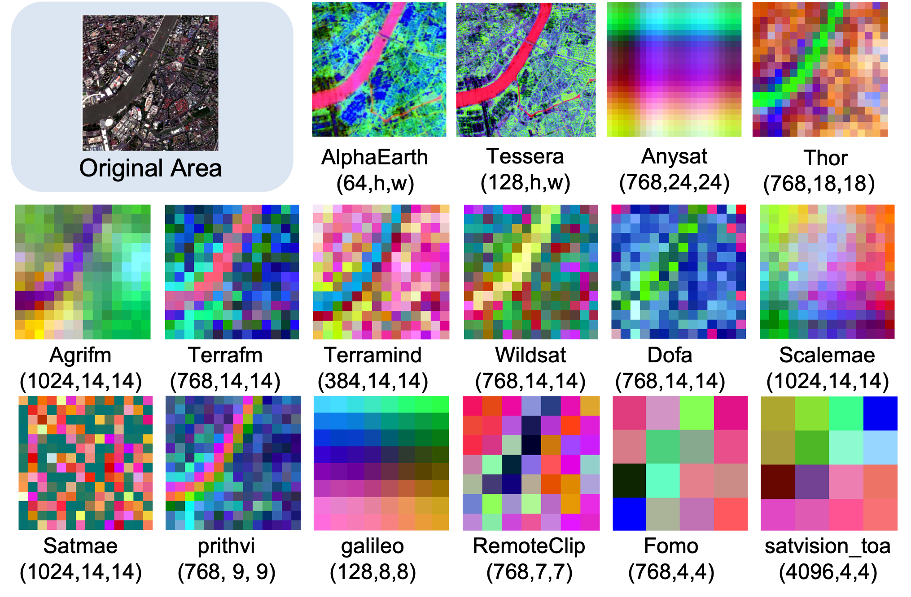

<div align="center">

#   rs-embed
**A single line of code to get embeddings from Any Remote Sensing Foundation Model (RSFM) for Any location and Any time**


[](https://cybergis.github.io/rs-embed/)


[Docs](https://cybergis.github.io/rs-embed/) · [Learn](https://cybergis.github.io/rs-embed/quickstart/) · [Guide](https://cybergis.github.io/rs-embed/workflows/) · [Playground](./examples/playground.ipynb)  · [Demo](./examples/demo.ipynb)

</div>


 


## TL;DR

```python
emb = get_embedding("tessera", spatial=..., temporal=..., output=..., backend="local")
```


## Install (temporary)
```bash
# temporary
git clone git@github.com:cybergis/rs-embed.git
cd rs-embed
conda env create -f environment.yml
conda activate rs-embed
pip install -e .

# If you are using GEE for the first time, run:
earthengine authenticate
```

## Quick Example
```python
from rs_embed import PointBuffer, TemporalSpec, OutputSpec, get_embedding

spatial = PointBuffer(lon=121.5, lat=31.2, buffer_m=2048)
temporal = TemporalSpec.year(2024)

emb = get_embedding(
    "gse",       # alpha earth
    spatial=spatial,
    temporal=temporal,
    output=OutputSpec.grid(),
    backend="gee",
)

```
You can also visualize the embedding as follows:

```python
from examples.plot_utils import plot_embedding_pseudocolor

plot_embedding_pseudocolor(
    emb,
    title="gse grid PCA pseudocolor",
)
```


 

## Supported Models (Quick Reference)

This is a convenience index with basic model info only (for quick scanning / links). For detailed I/O behavior and preprocessing notes, see [Supported Models](https://cybergis.github.io/rs-embed/models/).

Model IDs now use short canonical names (for example `remoteclip`, `prithvi`, `thor`). Legacy IDs such as `remoteclip_s2rgb` and `prithvi_eo_v2_s2_6b` are still accepted as backward-compatible aliases.

### Precomputed Embeddings

| Model ID | Type | Resolution | Time Coverage | Publication |
|---|---|---|---|---|
|`tessera` | Precomputed | 10m | 2017-2025 |[CVPR 2026](https://arxiv.org/abs/2506.20380v4)|
|`gse` (Alpha Earth) | Precomputed | 10 m | 2017-2024 |[arXiv 2025](https://arxiv.org/abs/2507.22291)|
| `copernicus` | Precomputed | 0.25° | 2021 |[ICCV 2025](https://arxiv.org/abs/2503.11849)|

### On-the-fly Foundation Models

| Model ID |  Primary Input  | Publication | Link |
|---|---|---|---|
| `satmae` |  S2 RGB | [NeurIPS 2022](https://arxiv.org/abs/2207.08051) |[link](https://github.com/sustainlab-group/SatMAE)|
| `prithvi` | S2 6-band | [arXiv 2023](https://arxiv.org/abs/2310.18660) | [link](https://huggingface.co/ibm-nasa-geospatial) |
| `scalemae` | S2 RGB (+ scale) | [ICCV 2023](https://arxiv.org/abs/2212.14532) | [link](https://github.com/bair-climate-initiative/scale-mae) |
| `remoteclip` |  S2 RGB | [TGRS 2024](https://arxiv.org/abs/2306.11029) |[link](https://github.com/ChenDelong1999/RemoteCLIP) |
| `dofa` |  Multi-band + wavelengths | [arXiv 2024](https://arxiv.org/abs/2403.15356) | [link](https://github.com/zhu-xlab/DOFA) |
| `satvision` |  TOA 14-channel | [arXiv 2024](https://arxiv.org/abs/2411.17000) | [link](https://github.com/nasa-nccs-hpda/pytorch-caney)|
| `anysat` |  S2 time series (10-band) | [CVPR 2025](https://arxiv.org/abs/2412.14123) | [link](https://github.com/gastruc/AnySat) |
| `galileo` | S2 time series (10-band) | [ICML 2025](https://arxiv.org/abs/2502.09356) | [link](https://github.com/nasaharvest/galileo) |
| `dynamicvis` | S2 RGB | [arXiv 2025](https://arxiv.org/abs/2503.16426) | [link](https://github.com/KyanChen/DynamicVis) |
| `wildsat` | S2 RGB | [ICCV 2025](https://arxiv.org/abs/2412.14428) | [link](https://github.com/mdchuc/HRSFM) |
| `fomo` | S2 12-band | [AAAI 2025](https://arxiv.org/abs/2312.10114) |[link](https://github.com/RolnickLab/FoMo-Bench)|
| `terramind` | S2 12-band | [ICCV 2025](https://arxiv.org/abs/2504.11171) | [link](https://github.com/IBM/terramind) |
| `terrafm` | S2 12-band / S1 VV-VH | [ICLR 2026](https://arxiv.org/abs/2506.06281) | [link](https://github.com/mbzuai-oryx/TerraFM) |
| `thor` | S2 10-band | [arXiv 2026](https://arxiv.org/abs/2601.16011) | [link](https://github.com/FM4CS/THOR) |
| `agrifm` | S2 time series (10-band) | [RSE 2026](https://www.sciencedirect.com/science/article/pii/S0034425726000040) | [link](https://github.com/flyakon/AgriFM) |


## Learn More

📚 [Full documentation](https://cybergis.github.io/rs-embed/)

🪄 [Get Started: Try `rs-embed` Now](/examples/playground.ipynb)

🪀 [Use case: Maize yield mapping Illinois](./examples/demo.ipynb)

## Extending

We welcome requests for new model integrations and extensions. If you have your own work, or a model/paper you care about and think is meaningful to include, please open an [Issue](https://github.com/cybergis/rs-embed/issues) and share it. We will prioritize helping extend `rs-embed` for those requests.

If you want to implement the extension yourself, you can also follow the guide in [`extending`](https://cybergis.github.io/rs-embed/extending/).


## 🎖 Acknowledgements
We would like to thank the following organizations and projects that make rs-embed possible: [Google Earth Engine](https://earthengine.google.com), [TorchGeo](https://github.com/torchgeo/torchgeo), [GeoTessera](https://github.com/ucam-eo/geotessera), [TerraTorch](https://github.com/terrastackai/terratorch), [rshf](https://github.com/mvrl/rshf).

This library also builds upon the incredible work of the Remote Sensing community!(Full list and citations available in our Documentation)

## License
This project is released under the [Apache-2.0](LICENSE)
