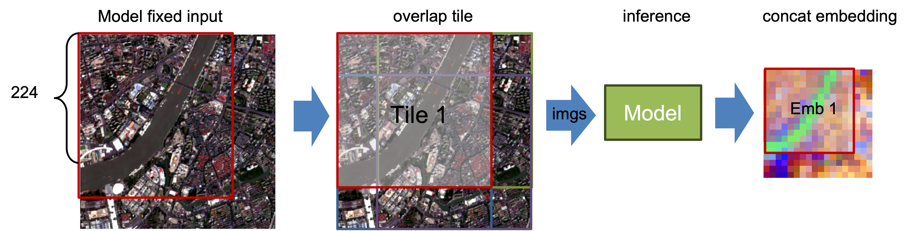

# API Specs & Data Structures

This page documents the core spec/data types used across the public API.

For task-oriented usage, see [Common Workflows](workflows.md). For exact embedding/export/inspect functions, see:

- [API: Embedding](api_embedding.md)
- [API: Export](api_export.md)
- [API: Inspect](api_inspect.md)

=== ":material-shape-outline: Spatial"

    Start with `SpatialSpec` (`BBox` or `PointBuffer`) to define the ROI.

=== ":material-calendar-range: Temporal"

    Use `TemporalSpec.year(...)` for precomputed/year-indexed products and `TemporalSpec.range(...)` for provider/on-the-fly fetch windows.

=== ":material-grid: Output"

    Use `OutputSpec.pooled()` first unless you specifically need spatial structure (`grid`).

---

## Data Structures

### SpatialSpec

`SpatialSpec` describes the spatial region for which you want to extract an embedding.

#### `BBox`

```python
BBox(minlon: float, minlat: float, maxlon: float, maxlat: float, crs: str = "EPSG:4326")
```

- An **EPSG:4326** lat/lon bounding box (the current version supports only EPSG:4326).
- `validate()` checks that bounds are valid.

#### `PointBuffer`

```python
PointBuffer(lon: float, lat: float, buffer_m: float, crs: str = "EPSG:4326")
```

- A buffer centered at a point, measured in meters (a square ROI; internally projected into the coordinate system required by the provider).
- Requires `buffer_m > 0`.

---

### TemporalSpec

`TemporalSpec` describes the time range (by year or by date range).

```python
TemporalSpec(mode: Literal["year", "range"], year: int | None, start: str | None, end: str | None)
```

Recommended constructors:

```python
TemporalSpec.year(2022)
TemporalSpec.range("2022-06-01", "2022-09-01")
```

!!! warning "Temporal range is a window"
    `TemporalSpec.range(start, end)` is treated as a half-open interval `[start, end)`, so `end` is excluded.

Temporal semantics in provider/on-the-fly paths:

- `TemporalSpec.range(start, end)` is interpreted as a half-open window `[start, end)`, where `end` is excluded.
- In GEE-backed on-the-fly fetch, `range` is used to filter an image collection over the full window, then apply a compositing reducer (default `median`, optional `mosaic`).
- So the fetched input is usually a composite over the whole time window, not an automatically selected single-day scene.
- To approximate a single-day query, pass a one-day window such as `TemporalSpec.range("2022-06-01", "2022-06-02")`.

About `input_time` in metadata:

- Many embedders store `meta["input_time"]` as the midpoint date of the temporal window.
- This midpoint is metadata (and for some models, an auxiliary time signal), not evidence that imagery was fetched from exactly that single date.

!!! note "Common gotcha"
    `input_time` often looks like a single date, but the actual provider fetch may still be a composite over the full temporal window.

---

### SensorSpec

`SensorSpec` is mainly for **on-the-fly** models (fetch a patch from GEE online and feed it into the model). It specifies which collection to pull from, which bands, and what resolution/compositing strategy to use.

```python
SensorSpec(
    collection: str,
    bands: Tuple[str, ...],
    scale_m: int = 10,
    cloudy_pct: int = 30,
    fill_value: float = 0.0,
    composite: Literal["median", "mosaic"] = "median",
    check_input: bool = False,
    check_raise: bool = True,
    check_save_dir: Optional[str] = None,
)
```

- `collection`: GEE collection or image ID
- `bands`: band names (tuple)
- `scale_m`: sampling resolution (meters)
- `cloudy_pct`: cloud filter (best-effort; depends on collection properties)
- `fill_value`: no-data fill value
- `composite`: image compositing method over the temporal window (median/mosaic)
- `check_*`: optional input checks and quicklook saving (see [`inspect_gee_patch`](api_inspect.md#inspect_gee_patch))

!!! note
    For **precomputed** models (e.g., directly reading offline embedding products), `sensor` is usually ignored or set to `None`.

---

### OutputSpec

`OutputSpec` controls the embedding output shape: a **pooled vector** or a **dense grid**.

```python
OutputSpec(
    mode: Literal["grid", "pooled"],
    scale_m: int = 10,
    pooling: Literal["mean", "max"] = "mean",
    grid_orientation: Literal["north_up", "native"] = "north_up",
)
```

Recommended constructors:

=== ":material-vector-line: Pooled (default)"

    ```python
    OutputSpec.pooled(pooling="mean")   # shape: (D,)
    ```

=== ":material-grid: Grid (spatial)"

    ```python
    OutputSpec.grid(scale_m=10)         # shape: (D, H, W), normalized to north-up when possible
    OutputSpec.grid(scale_m=10, grid_orientation="native")  # keep model/provider native orientation
    ```


#### `pooled`

> ROI-level Vector Embedding

**Semantic meaning**

`pooled` represents one whole ROI (Region of Interest) using a single vector `(D,)`.

Best suited for:

- Classification / regression
- Retrieval / similarity search
- Clustering
- Cross-model comparison (recommended)

Unified output format:

```python
Embedding.data.shape == (D,)
```

How it is produced:

ViT / MAE-style models (e.g., RemoteCLIP / Prithvi / SatMAE / ScaleMAE):

- Native output is patch tokens `(N, D)` (with optional CLS token)
- Remove CLS token if present, then pool tokens across the token axis (`mean` by default, optional `max`)

Mean-pooling formula:

$$
v_d = \frac{1}{N'} \sum_{i=1}^{N'} t_{i,d}
$$

Precomputed embeddings (e.g., Tessera / GSE / Copernicus):

- Native output is an embedding grid `(D, H, W)`
- Pool over spatial dimensions `(H, W)`

$$
v_d = \frac{1}{HW} \sum_{y,x} g_{d,y,x}
$$

Why prefer `pooled` for benchmarks:

- Model-agnostic and stable
- Less sensitive to spatial/token layout differences
- Easiest output to compare across models

#### `grid`
> ROI-level Spatial Embedding Field

**Semantic meaning**

`grid` returns a spatial embedding field `(D, H, W)`, where each spatial location maps to a vector.

Best suited for:

- Spatial visualization (PCA / norm / similarity maps)
- Pixel-wise / patch-wise tasks
- Intra-ROI structure analysis

Unified output format:

```python
Embedding.data.shape == (D, H, W)
```

Notes:

- `data` can be returned as `xarray.DataArray` with metadata in `meta`/`attrs`
- For precomputed geospatial products, metadata may include CRS/crop context
- For ViT token grids, this is usually patch-grid metadata (not georeferenced pixel coordinates)

How it is produced:

ViT / MAE-style models:

- Native output: tokens `(N, D)`
- Remove CLS token if present, reshape remaining tokens:
- `(N', D) -> (H, W, D) -> (D, H, W)`
- `(H, W)` comes from patch layout (for example, `8x8`, `14x14`)

Precomputed embeddings:

- Native output is already `(D, H, W)`

---

### InputPrepSpec 
> Optional Large-ROI Input Policy

`InputPrepSpec` controls API-level handling of large on-the-fly inputs before model inference.
This is mainly useful when you want to choose between the model's normal resize path and API-side tiled inference.

```python
InputPrepSpec(
    mode: Literal["resize", "tile", "auto"] = "resize",
    tile_size: Optional[int] = None,
    tile_stride: Optional[int] = None,
    max_tiles: int = 9,
    pad_edges: bool = True,
)
```

Recommended constructors:

```python
InputPrepSpec.resize()               # default behavior (fastest)
InputPrepSpec.tile()                 # tile size inferred from model defaults.image_size when available
InputPrepSpec.auto(max_tiles=4)      # choose tile or resize automatically
InputPrepSpec.tile(tile_size=224)    # explicit tile size override
```

You can also pass a string to public APIs as a shorthand:

```python
input_prep="resize"   # default
input_prep="tile"
input_prep="auto"
```

Current tiled design (API layer):

- Tile size defaults to `embedder.describe()["defaults"]["image_size"]` when available (can be overridden).
- Boundary tiles use a **cover-shift** layout (for example `300 -> [0,224]` and `[76,300]`) to avoid edge padding when possible.
- Grid stitching uses **midpoint-cut** ownership in overlap regions (instead of hard overwrite).
- `tile_stride` currently must equal `tile_size` (explicit overlap/gap configuration is not enabled yet), but boundary shifting can still create overlap on the last tile.
- `auto` is conservative and currently prefers tiling mainly for `OutputSpec.grid()` when tile count is small enough (`max_tiles`).



<!--  -->


---

### Embedding

`get_embedding` / `get_embeddings_batch` return an `Embedding`:

```python
from rs_embed.core.embedding import Embedding

Embedding(
    data: np.ndarray | xarray.DataArray,
    meta: Dict[str, Any],
)
```

- `data`: the embedding data (float32, vector or grid)
- `meta`: includes model info, input info (optional), and export/check reports, etc.

---
